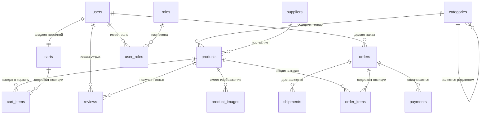

# Лабораторная работа №1

- **Тема:** Проектирование базы данных для интернет-магазина (E-commerce)
- **Автор:** Коваленко Н. К.
- **Группа:** 453502

---

## Расшифровка сокращений

| Сокращение | Расшифровка                              | Значение                                                        |
| ---------- | ---------------------------------------- | --------------------------------------------------------------- |
| **PK**     | Primary Key                              | Первичный ключ — уникальный идентификатор записи в таблице      |
| **FK**     | Foreign Key                              | Внешний ключ — ссылка на первичный ключ другой таблицы          |
| **AK**     | Alternate Key                            | Альтернативный ключ — уникальное поле, не являющееся первичным  |
| **1:1**    | One-to-One                               | Связь «один к одному»                                           |
| **1:N**    | One-to-Many                              | Связь «один ко многим»                                          |
| **M:N**    | Many-to-Many                             | Связь «многие ко многим»                                        |
| **1НФ**    | Первая нормальная форма                  | Все атрибуты атомарны                                           |
| **2НФ**    | Вторая нормальная форма                  | 1НФ + полная функциональная зависимость от первичного ключа     |
| **3НФ**    | Третья нормальная форма                  | 2НФ + отсутствие транзитивных зависимостей                      |
| **ER**     | Entity-Relationship                      | Модель «сущность — связь»                                       |
| **DDL**    | Data Definition Language                 | Язык определения данных (CREATE, ALTER, DROP)                   |
| **DML**    | Data Manipulation Language               | Язык манипулирования данными (SELECT, INSERT, UPDATE, DELETE)   |
| **SQL**    | Structured Query Language                | Язык структурированных запросов                                 |

---

## Описание проекта

**E-commerce DB** — это проект базы данных для интернет-магазина, разработанный в рамках лабораторного практикума по дисциплине «Базы данных».

Интернет-магазин — это торговая площадка, где пользователи могут просматривать товары, добавлять их в корзину, оформлять заказы, оплачивать и получать доставку. Товары сгруппированы по категориям, у каждого товара может быть несколько изображений. Поставщики поставляют товары на склад магазина. Пользователи могут оставлять отзывы и оценки на купленные товары.

Работа интернет-магазина состоит из нескольких этапов:

1. Пользователь регистрируется в системе и получает одну или несколько ролей.
2. Пользователь просматривает каталог товаров, сгруппированных по категориям.
3. Пользователь добавляет понравившиеся товары в корзину.
4. Пользователь оформляет заказ, указывая адрес доставки.
5. Заказ оплачивается одним или несколькими платежами.
6. Заказ отправляется службой доставки и отслеживается по трек-номеру.
7. После получения товара пользователь может оставить отзыв и оценку.

Заказы проходят жизненный цикл: `создан → оплачен → отправлен → доставлен` или `отменён`.

---

## Абстракции предметной области

### Сущность «Пользователь» (users)

Описывает зарегистрированного пользователя интернет-магазина.

| Поле            | Тип          | Ограничения                          | Описание                     |
| --------------- | ------------ | ------------------------------------ | ---------------------------- |
| `user_id`       | INT          | PK, AUTO_INCREMENT                   | Идентификатор пользователя   |
| `email`         | VARCHAR(255) | UNIQUE, NOT NULL                     | Электронная почта            |
| `password_hash` | VARCHAR(255) | NOT NULL                             | Хэш пароля                   |
| `first_name`    | VARCHAR(100) | NOT NULL                             | Имя                          |
| `last_name`     | VARCHAR(100) | NOT NULL                             | Фамилия                      |
| `phone`         | VARCHAR(20)  |                                      | Телефон                      |
| `created_at`    | DATETIME     | NOT NULL, DEFAULT CURRENT_TIMESTAMP  | Дата регистрации             |
| `is_active`     | BOOL         | NOT NULL, DEFAULT TRUE               | Активен ли аккаунт           |

### Сущность «Роль» (roles)

Справочник ролей пользователей (администратор, менеджер, покупатель и т. д.).

| Поле          | Тип          | Ограничения        | Описание           |
| ------------- | ------------ | ------------------ | ------------------ |
| `role_id`     | INT          | PK, AUTO_INCREMENT | Идентификатор роли |
| `name`        | VARCHAR(50)  | UNIQUE, NOT NULL   | Название роли      |
| `description` | VARCHAR(255) |                    | Описание роли      |

### Сущность «Пользователь-Роль» (user_roles)

Связывает пользователей и роли (M:N).

| Поле         | Тип      | Ограничения                          | Описание                   |
| ------------ | -------- | ------------------------------------ | -------------------------- |
| `user_id`    | INT      | FK → users(user_id)                  | Идентификатор пользователя |
| `role_id`    | INT      | FK → roles(role_id)                  | Идентификатор роли         |
| `granted_at` | DATETIME | NOT NULL, DEFAULT CURRENT_TIMESTAMP  | Дата назначения роли       |

**Первичный ключ:** `(user_id, role_id)`

### Сущность «Категория» (categories)

Справочник категорий товаров с поддержкой иерархии.

| Поле          | Тип          | Ограничения                        | Описание                     |
| ------------- | ------------ | ---------------------------------- | ---------------------------- |
| `category_id` | INT          | PK, AUTO_INCREMENT                 | Идентификатор категории      |
| `name`        | VARCHAR(100) | NOT NULL                           | Название категории           |
| `parent_id`   | INT          | FK → categories(category_id), NULL | Родительская категория       |
| `description` | VARCHAR(500) |                                    | Описание категории           |

### Сущность «Поставщик» (suppliers)

Справочник компаний-поставщиков товаров.

| Поле             | Тип          | Ограничения        | Описание                 |
| ---------------- | ------------ | ------------------ | ------------------------ |
| `supplier_id`    | INT          | PK, AUTO_INCREMENT | Идентификатор поставщика |
| `name`           | VARCHAR(200) | NOT NULL           | Название компании        |
| `contact_person` | VARCHAR(200) |                    | Контактное лицо          |
| `phone`          | VARCHAR(20)  |                    | Телефон                  |
| `email`          | VARCHAR(255) |                    | Email                    |
| `address`        | VARCHAR(500) |                    | Адрес                    |

### Сущность «Товар» (products)

Описывает товар, доступный для продажи.

| Поле             | Тип           | Ограничения                                          | Описание                     |
| ---------------- | ------------- | ---------------------------------------------------- | ---------------------------- |
| `product_id`     | INT           | PK, AUTO_INCREMENT                                   | Идентификатор товара         |
| `name`           | VARCHAR(200)  | NOT NULL                                             | Название товара              |
| `description`    | TEXT          |                                                      | Описание товара              |
| `price`          | DECIMAL(10,2) | NOT NULL, CHECK (price >= 0)                         | Цена                         |
| `stock_quantity` | INT           | NOT NULL, DEFAULT 0, CHECK (stock_quantity >= 0)     | Остаток на складе            |
| `category_id`    | INT           | FK → categories(category_id)                         | Категория                    |
| `supplier_id`    | INT           | FK → suppliers(supplier_id)                          | Поставщик                    |
| `created_at`     | DATETIME      | NOT NULL, DEFAULT CURRENT_TIMESTAMP                  | Дата создания                |
| `updated_at`     | DATETIME      |                                                      | Дата обновления              |

### Сущность «Изображение товара» (product_images)

Хранит изображения, привязанные к товару.

| Поле         | Тип          | Ограничения               | Описание                  |
| ------------ | ------------ | ------------------------- | ------------------------- |
| `image_id`   | INT          | PK, AUTO_INCREMENT        | Идентификатор изображения |
| `product_id` | INT          | FK → products(product_id) | Товар                     |
| `image_url`  | VARCHAR(500) | NOT NULL                  | URL изображения           |
| `is_main`    | BOOL         | NOT NULL, DEFAULT FALSE   | Является ли главным       |

### Сущность «Корзина» (carts)

Описывает корзину покупок пользователя.

| Поле         | Тип      | Ограничения                          | Описание               |
| ------------ | -------- | ------------------------------------ | ---------------------- |
| `cart_id`    | INT      | PK, AUTO_INCREMENT                   | Идентификатор корзины  |
| `user_id`    | INT      | FK → users(user_id), UNIQUE          | Владелец корзины       |
| `created_at` | DATETIME | NOT NULL, DEFAULT CURRENT_TIMESTAMP  | Дата создания          |
| `updated_at` | DATETIME |                                      | Дата обновления        |

### Сущность «Позиция корзины» (cart_items)

Товары, добавленные пользователем в корзину.

| Поле         | Тип      | Ограничения                          | Описание            |
| ------------ | -------- | ------------------------------------ | ------------------- |
| `cart_id`    | INT      | FK → carts(cart_id)                  | Корзина             |
| `product_id` | INT      | FK → products(product_id)            | Товар               |
| `quantity`   | INT      | NOT NULL, CHECK (quantity > 0)       | Количество          |
| `added_at`   | DATETIME | NOT NULL, DEFAULT CURRENT_TIMESTAMP  | Дата добавления     |

**Первичный ключ:** `(cart_id, product_id)`

### Сущность «Заказ» (orders)

Описывает оформленный пользователем заказ.

| Поле               | Тип           | Ограничения                                                                                          | Описание             |
| ------------------ | ------------- | ---------------------------------------------------------------------------------------------------- | -------------------- |
| `order_id`         | INT           | PK, AUTO_INCREMENT                                                                                   | Идентификатор заказа |
| `user_id`          | INT           | FK → users(user_id)                                                                                  | Покупатель           |
| `order_date`       | DATETIME      | NOT NULL, DEFAULT CURRENT_TIMESTAMP                                                                  | Дата заказа          |
| `status`           | VARCHAR(20)   | NOT NULL, CHECK (status IN ('new','paid','shipped','cancelled','completed'))                         | Статус заказа        |
| `total_amount`     | DECIMAL(12,2) | NOT NULL, CHECK (total_amount >= 0)                                                                  | Общая сумма          |
| `shipping_address` | VARCHAR(500)  | NOT NULL                                                                                             | Адрес доставки       |

### Сущность «Позиция заказа» (order_items)

Содержит товары, входящие в заказ.

| Поле              | Тип           | Ограничения                          | Описание              |
| ----------------- | ------------- | ------------------------------------ | --------------------- |
| `order_id`        | INT           | FK → orders(order_id)                | Заказ                 |
| `product_id`      | INT           | FK → products(product_id)            | Товар                 |
| `quantity`        | INT           | NOT NULL, CHECK (quantity > 0)       | Количество            |
| `price_at_moment` | DECIMAL(10,2) | NOT NULL, CHECK (price_at_moment >= 0) | Цена на момент заказа |

**Первичный ключ:** `(order_id, product_id)`

### Сущность «Платёж» (payments)

Описывает платежи по заказу.

| Поле           | Тип           | Ограничения                                              | Описание             |
| -------------- | ------------- | -------------------------------------------------------- | -------------------- |
| `payment_id`   | INT           | PK, AUTO_INCREMENT                                       | Идентификатор платежа |
| `order_id`     | INT           | FK → orders(order_id)                                    | Заказ                |
| `payment_date` | DATETIME      | NOT NULL, DEFAULT CURRENT_TIMESTAMP                      | Дата платежа         |
| `amount`       | DECIMAL(12,2) | NOT NULL, CHECK (amount >= 0)                            | Сумма платежа        |
| `method`       | VARCHAR(50)   | NOT NULL, CHECK (method IN ('card','cash','online'))     | Способ оплаты        |
| `status`       | VARCHAR(20)   | NOT NULL, CHECK (status IN ('pending','completed','failed')) | Статус платежа   |

### Сущность «Доставка» (shipments)

Описывает доставку заказа.

| Поле              | Тип          | Ограничения                                                       | Описание              |
| ----------------- | ------------ | ----------------------------------------------------------------- | --------------------- |
| `shipment_id`     | INT          | PK, AUTO_INCREMENT                                                | Идентификатор доставки |
| `order_id`        | INT          | FK → orders(order_id)                                             | Заказ                 |
| `shipment_date`   | DATETIME     |                                                                   | Дата отправки         |
| `delivery_date`   | DATETIME     |                                                                   | Дата доставки         |
| `tracking_number` | VARCHAR(100) |                                                                   | Трек-номер            |
| `carrier`         | VARCHAR(100) |                                                                   | Служба доставки       |
| `status`          | VARCHAR(20)  | NOT NULL, CHECK (status IN ('preparing','shipped','delivered'))   | Статус доставки       |

### Сущность «Отзыв» (reviews)

Описывает отзыв и оценку товара пользователем.

| Поле         | Тип      | Ограничения                                     | Описание              |
| ------------ | -------- | ----------------------------------------------- | --------------------- |
| `review_id`  | INT      | PK, AUTO_INCREMENT                              | Идентификатор отзыва  |
| `user_id`    | INT      | FK → users(user_id)                             | Автор отзыва          |
| `product_id` | INT      | FK → products(product_id)                       | Товар                 |
| `rating`     | INT      | NOT NULL, CHECK (rating BETWEEN 1 AND 5)        | Оценка                |
| `comment`    | TEXT     |                                                 | Текст отзыва          |
| `created_at` | DATETIME | NOT NULL, DEFAULT CURRENT_TIMESTAMP             | Дата создания         |

---

## Связи между сущностями

| Связь                                | Тип | Описание                                                       |
| ------------------------------------ | --- | -------------------------------------------------------------- |
| users – orders                       | 1:N | Один пользователь может сделать много заказов                  |
| users – reviews                      | 1:N | Один пользователь может оставить много отзывов                 |
| users – carts                        | 1:1 | У пользователя одна активная корзина                           |
| users – user_roles                   | 1:N | Пользователю может быть назначено несколько ролей              |
| roles – user_roles                   | 1:N | Роль может быть назначена многим пользователям                 |
| categories – products                | 1:N | В категории много товаров                                      |
| categories – categories              | 1:N | Иерархия категорий                                             |
| suppliers – products                 | 1:N | Поставщик поставляет много товаров                             |
| products – product_images            | 1:N | У товара много изображений                                     |
| products – order_items               | 1:N | Товар может входить во многие заказы                           |
| orders – order_items                 | 1:N | Заказ содержит много товаров                                   |
| products – cart_items                | 1:N | Товар может быть во многих корзинах                            |
| carts – cart_items                   | 1:N | Корзина содержит много товаров                                 |
| orders – payments                    | 1:N | Заказ может иметь несколько платежей                           |
| orders – shipments                   | 1:N | Заказ может иметь несколько доставок                           |
| products – reviews                   | 1:N | Товар может иметь много отзывов                                |

---

## Перечень возможных запросов к базе данных

1. Вывести всех пользователей.
2. Вывести всех пользователей с ролью «администратор».
3. Вывести все товары в категории «Электроника».
4. Вывести все товары дороже 1000 рублей, отсортированные по цене.
5. Вывести все заказы пользователя с email `ivan@example.com`.
6. Вывести все заказы со статусом «оплачен».
7. Вывести все товары, которые никогда не заказывали.
8. Вывести список категорий и количество товаров в каждой.
9. Вывести среднюю оценку для каждого товара.
10. Вывести топ-5 самых продаваемых товаров.
11. Вывести всех пользователей, которые оставили более 3 отзывов.
12. Вывести общую сумму всех заказов за текущий месяц.
13. Вывести количество заказов по каждому статусу.
14. Вывести всех поставщиков и количество поставляемых ими товаров.
15. Вывести все отзывы с оценкой 5 для товара «Смартфон».
16. Вывести список товаров в корзине пользователя с email `petr@example.com`.
17. Вывести средний чек по всем заказам.
18. Вывести всех пользователей, у которых есть незавершённые заказы.
19. Вывести информацию о платежах: номер заказа, сумма, способ оплаты.
20. Вывести все доставки со статусом «в пути».

---

## Концептуальная модель (ER-диаграмма)



---

## Реляционная модель

| Таблица            | Атрибуты                                                                                                          |
| ------------------ | ----------------------------------------------------------------------------------------------------------------- |
| **users**          | user_id, email, password_hash, first_name, last_name, phone, created_at, is_active                                |
| **roles**          | role_id, name, description                                                                                        |
| **user_roles**     | user_id, role_id, granted_at                                                                                      |
| **categories**     | category_id, name, parent_id, description                                                                         |
| **suppliers**      | supplier_id, name, contact_person, phone, email, address                                                          |
| **products**       | product_id, name, description, price, stock_quantity, category_id, supplier_id, created_at, updated_at            |
| **product_images** | image_id, product_id, image_url, is_main                                                                          |
| **carts**          | cart_id, user_id, created_at, updated_at                                                                          |
| **cart_items**     | cart_id, product_id, quantity, added_at                                                                           |
| **orders**         | order_id, user_id, order_date, status, total_amount, shipping_address                                             |
| **order_items**    | order_id, product_id, quantity, price_at_moment                                                                   |
| **payments**       | payment_id, order_id, payment_date, amount, method, status                                                        |
| **shipments**      | shipment_id, order_id, shipment_date, delivery_date, tracking_number, carrier, status                             |
| **reviews**        | review_id, user_id, product_id, rating, comment, created_at                                                       |

---

## Домены

Домен — это допустимое множество значений, которые может принимать атрибут.

| Атрибут            | Тип данных    | Ограничения                                                                   |
| ------------------ | ------------- | ----------------------------------------------------------------------------- |
| `user_id`          | INT           | Целое положительное, уникальное                                                |
| `email`            | VARCHAR(255)  | Строка длиной до 255, уникальная, соответствует шаблону email                 |
| `password_hash`    | VARCHAR(255)  | Строка длиной до 255                                                           |
| `first_name`       | VARCHAR(100)  | Строка длиной до 100                                                           |
| `last_name`        | VARCHAR(100)  | Строка длиной до 100                                                           |
| `phone`            | VARCHAR(20)   | Строка длиной до 20                                                            |
| `created_at`       | DATETIME      | Дата и время                                                                   |
| `is_active`        | BOOL          | TRUE / FALSE                                                                   |
| `role_id`          | INT           | Целое положительное, уникальное                                                |
| `name` (role)      | VARCHAR(50)   | Строка длиной до 50, уникальная                                                |
| `description`      | VARCHAR(255)  | Строка длиной до 255                                                           |
| `granted_at`       | DATETIME      | Дата и время                                                                   |
| `category_id`      | INT           | Целое положительное, уникальное                                                |
| `name` (category)  | VARCHAR(100)  | Строка длиной до 100                                                           |
| `parent_id`        | INT           | Целое положительное или NULL                                                   |
| `supplier_id`      | INT           | Целое положительное, уникальное                                                |
| `name` (supplier)  | VARCHAR(200)  | Строка длиной до 200                                                           |
| `contact_person`   | VARCHAR(200)  | Строка длиной до 200                                                           |
| `address`          | VARCHAR(500)  | Строка длиной до 500                                                           |
| `product_id`       | INT           | Целое положительное, уникальное                                                |
| `name` (product)   | VARCHAR(200)  | Строка длиной до 200                                                           |
| `price`            | DECIMAL(10,2) | Число с двумя знаками после запятой, >= 0                                      |
| `stock_quantity`   | INT           | Целое неотрицательное                                                          |
| `image_id`         | INT           | Целое положительное, уникальное                                                |
| `image_url`        | VARCHAR(500)  | Строка длиной до 500                                                           |
| `is_main`          | BOOL          | TRUE / FALSE                                                                   |
| `cart_id`          | INT           | Целое положительное, уникальное                                                |
| `quantity`         | INT           | Целое положительное (> 0)                                                      |
| `added_at`         | DATETIME      | Дата и время                                                                   |
| `order_id`         | INT           | Целое положительное, уникальное                                                |
| `order_date`       | DATETIME      | Дата и время                                                                   |
| `status` (order)   | VARCHAR(20)   | Одно из: `new`, `paid`, `shipped`, `cancelled`, `completed`                    |
| `total_amount`     | DECIMAL(12,2) | Число с двумя знаками после запятой, >= 0                                      |
| `shipping_address` | VARCHAR(500)  | Строка длиной до 500                                                           |
| `price_at_moment`  | DECIMAL(10,2) | Число с двумя знаками после запятой, >= 0                                      |
| `payment_id`       | INT           | Целое положительное, уникальное                                                |
| `payment_date`     | DATETIME      | Дата и время                                                                   |
| `amount`           | DECIMAL(12,2) | Число с двумя знаками после запятой, >= 0                                      |
| `method`           | VARCHAR(50)   | Одно из: `card`, `cash`, `online`                                              |
| `status` (payment) | VARCHAR(20)   | Одно из: `pending`, `completed`, `failed`                                      |
| `shipment_id`      | INT           | Целое положительное, уникальное                                                |
| `shipment_date`    | DATETIME      | Дата и время                                                                   |
| `delivery_date`    | DATETIME      | Дата и время                                                                   |
| `tracking_number`  | VARCHAR(100)  | Строка длиной до 100                                                           |
| `carrier`          | VARCHAR(100)  | Строка длиной до 100                                                           |
| `status` (shipment)| VARCHAR(20)   | Одно из: `preparing`, `shipped`, `delivered`                                   |
| `review_id`        | INT           | Целое положительное, уникальное                                                |
| `rating`           | INT           | Целое от 1 до 5                                                                |
| `comment`          | TEXT          | Текст произвольной длины                                                       |

---

## Ключи и внешние ключи

| Таблица            | Первичный ключ (PK)      | Внешние ключи (FK)                                                                              |
| ------------------ | ------------------------ | ----------------------------------------------------------------------------------------------- |
| **users**          | `user_id`                | —                                                                                               |
| **roles**          | `role_id`                | —                                                                                               |
| **user_roles**     | `(user_id, role_id)`     | `user_id` → users(user_id), `role_id` → roles(role_id)                                          |
| **categories**     | `category_id`            | `parent_id` → categories(category_id)                                                           |
| **suppliers**      | `supplier_id`            | —                                                                                               |
| **products**       | `product_id`             | `category_id` → categories(category_id), `supplier_id` → suppliers(supplier_id)                 |
| **product_images** | `image_id`               | `product_id` → products(product_id)                                                             |
| **carts**          | `cart_id`                | `user_id` → users(user_id)                                                                      |
| **cart_items**     | `(cart_id, product_id)`  | `cart_id` → carts(cart_id), `product_id` → products(product_id)                                 |
| **orders**         | `order_id`               | `user_id` → users(user_id)                                                                      |
| **order_items**    | `(order_id, product_id)` | `order_id` → orders(order_id), `product_id` → products(product_id)                              |
| **payments**       | `payment_id`             | `order_id` → orders(order_id)                                                                   |
| **shipments**      | `shipment_id`            | `order_id` → orders(order_id)                                                                   |
| **reviews**        | `review_id`              | `user_id` → users(user_id), `product_id` → products(product_id)                                 |

---

## Функциональные зависимости

Функциональная зависимость `A → B` означает, что каждому значению атрибута `A` соответствует ровно одно значение атрибута `B`.

### users
- `user_id → email, password_hash, first_name, last_name, phone, created_at, is_active`
- `email → user_id` (кандидатный ключ)

### roles
- `role_id → name, description`
- `name → role_id` (кандидатный ключ)

### user_roles
- `(user_id, role_id) → granted_at`

### categories
- `category_id → name, parent_id, description`

### suppliers
- `supplier_id → name, contact_person, phone, email, address`

### products
- `product_id → name, description, price, stock_quantity, category_id, supplier_id, created_at, updated_at`

### product_images
- `image_id → product_id, image_url, is_main`

### carts
- `cart_id → user_id, created_at, updated_at`
- `user_id → cart_id` (кандидатный ключ)

### cart_items
- `(cart_id, product_id) → quantity, added_at`

### orders
- `order_id → user_id, order_date, status, total_amount, shipping_address`

### order_items
- `(order_id, product_id) → quantity, price_at_moment`

### payments
- `payment_id → order_id, payment_date, amount, method, status`

### shipments
- `shipment_id → order_id, shipment_date, delivery_date, tracking_number, carrier, status`

### reviews
- `review_id → user_id, product_id, rating, comment, created_at`

---

## Нормализация до 3НФ

Нормализация — это процесс разбиения (декомпозиции) таблицы на две или более с целью ликвидации дублирования данных и потенциальной их противоречивости. Конечная цель нормализации — получить такой проект БД, в котором «каждый факт появляется лишь в одном месте».

### Первая нормальная форма (1НФ)

Таблица находится в 1НФ, если на пересечении любой строки и столбца находится единственное значение, не требующее декомпозиции, и никогда не может быть множества таких значений. Все атрибуты атомарны. Все таблицы удовлетворяют 1НФ.

### Вторая нормальная форма (2НФ)

Таблица находится во 2НФ, если она удовлетворяет 1НФ и все её неключевые атрибуты находятся в полной функциональной зависимости от первичного ключа. Иными словами, в 2НФ нет неключевых атрибутов, зависящих от части составного ключа.

В таблицах с составными первичными ключами (`user_roles`, `cart_items`, `order_items`) неключевые атрибуты зависят от всего составного ключа, а не от его части:
- В `order_items` атрибуты `quantity` и `price_at_moment` зависят от пары `(order_id, product_id)`, но не от `order_id` или `product_id` по отдельности.
- В `cart_items` атрибуты `quantity` и `added_at` зависят от пары `(cart_id, product_id)`.
- В `user_roles` атрибут `granted_at` зависит от пары `(user_id, role_id)`.

Таким образом, 2НФ выполняется для всех таблиц.

### Третья нормальная форма (3НФ)

Таблица находится в 3НФ, если она удовлетворяет 2НФ и ни один из её неключевых атрибутов не связан функциональной зависимостью с любым другим неключевым атрибутом (отсутствуют транзитивные зависимости).

- В таблице `products` атрибуты `category_id` и `supplier_id` являются внешними ключами — названия категории и поставщика хранятся в отдельных таблицах `categories` и `suppliers`, что устраняет транзитивные зависимости.
- В таблице `orders` атрибут `total_amount` не зависит от других неключевых атрибутов.
- В таблице `user_roles` все неключевые атрибуты зависят только от составного первичного ключа.
- В таблице `reviews` атрибуты `rating` и `comment` зависят только от `review_id`.

Все таблицы приведены к 3НФ.

### Итог

Полученная реляционная модель состоит из **14 отношений**, каждое из которых находится в **третьей нормальной форме**. Модель не содержит дублирования данных и аномалий вставки, обновления и удаления.

---

## ER-диаграмма (итоговая модель)

```mermaid
erDiagram
    users ||--o{ orders : places
    users ||--o{ reviews : writes
    users ||--|| carts : has
    users ||--o{ user_roles : has
    roles ||--o{ user_roles : assigned
    categories ||--o{ products : contains
    categories ||--o{ categories : parent
    suppliers ||--o{ products : supplies
    products ||--o{ product_images : has
    products ||--o{ order_items : included
    products ||--o{ cart_items : included
    products ||--o{ reviews : receives
    orders ||--|{ order_items : contains
    orders ||--o{ payments : has
    orders ||--o{ shipments : has
    carts ||--o{ cart_items : contains

    users {
        int user_id PK
        varchar email
        varchar password_hash
        varchar first_name
        varchar last_name
        varchar phone
        datetime created_at
        bool is_active
    }

    roles {
        int role_id PK
        varchar name
        varchar description
    }

    user_roles {
        int user_id PK
        int role_id PK
        datetime granted_at
    }

    categories {
        int category_id PK
        varchar name
        int parent_id FK
        varchar description
    }

    suppliers {
        int supplier_id PK
        varchar name
        varchar contact_person
        varchar phone
        varchar email
        varchar address
    }

    products {
        int product_id PK
        varchar name
        text description
        decimal price
        int stock_quantity
        int category_id FK
        int supplier_id FK
        datetime created_at
        datetime updated_at
    }

    product_images {
        int image_id PK
        int product_id FK
        varchar image_url
        bool is_main
    }

    carts {
        int cart_id PK
        int user_id FK
        datetime created_at
        datetime updated_at
    }

    cart_items {
        int cart_id PK
        int product_id PK
        int quantity
        datetime added_at
    }

    orders {
        int order_id PK
        int user_id FK
        datetime order_date
        varchar status
        decimal total_amount
        varchar shipping_address
    }

    order_items {
        int order_id PK
        int product_id PK
        int quantity
        decimal price_at_moment
    }

    payments {
        int payment_id PK
        int order_id FK
        datetime payment_date
        decimal amount
        varchar method
        varchar status
    }

    shipments {
        int shipment_id PK
        int order_id FK
        datetime shipment_date
        datetime delivery_date
        varchar tracking_number
        varchar carrier
        varchar status
    }

    reviews {
        int review_id PK
        int user_id FK
        int product_id FK
        int rating
        text comment
        datetime created_at
    }


